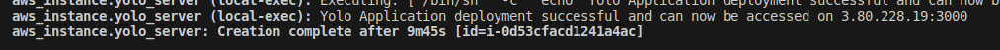
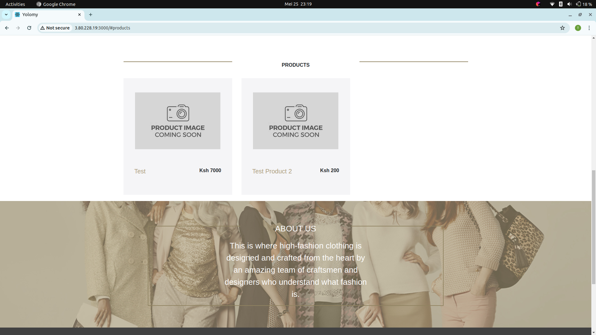

# Vagrant, Ansible, and Terraform Provisioning

This repository contains an Ansible playbook that automates the provisioning of infrastructure using Vagrant, Ansible, and Terraform. Vagrant is used to manage virtual machines, Ansible for configuration management, and Terraform for infrastructure provisioning.

## Prerequisites

Before you begin, ensure you have the following installed on your system:

- [Vagrant](https://www.vagrantup.com/downloads.html)
- [Ansible](https://docs.ansible.com/ansible/latest/installation_guide/intro_installation.html)
- [Terraform](https://www.terraform.io/downloads.html)


### Stage 1: Ansible Instrumentation
This will Provision ubuntu using vagrant and deploy yolo application using ansible on a VM

## ansible roles

1. docker: Installs and configures Docker on target environment.
2. clone_app: Clones the application source code.
3. database: pulls the mongo database image.
4. backend: Configures and builds the backend.
5. frontend: Configures and builds the frontend.
6. start_services: Starts yolo docker services.

## Usage
1. Clone this repository to your local machine:

    ```bash
    git clone https://github.com/charlesmagutu/yolo.git
    cd ansible
    ```

2. Execute the Ansible playbook to provision the infrastructure, configure the resources and depoy application :

    ```bash
    ansible-playbook playbook.yml

    ```
### Stage 2: Ansible and Terraform  instrumentation
This will Provision AWS Ec2 instance using terraform and deploy yolo application using ansible

```bash
cd ansible/Stage_two
```
## Update Variables
Edit the variables.tf file to configure variables such as private_key_path, aws_access_key, aws_secret_key, region, ami, instance_type, key_name, etc., according to your AWS environment and requirements.


## Terraform Init
```bash
terraform init
```
## Terraform Plan
```bash
terraform plan
```

### Terraform Apply
```bash
terraform apply --auto-aprove
```
Confirm the connectioin for ansible to cannect by typing yes when prompted.


## Access The application

To access the deployed application on EC2 instance check the console for the pulick ip and use port 3000 on your web browser



The application running correclty
Home Page
)
Products Page
)

## Notes

- Ensure you have the necessary permissions to execute Vagrant, Ansible, and Terraform commands and Ansible playbook.
- Customize the Terraform configuration according to your infrastructure requirements.
- Review the output to ensure the provisioning process completes successfully.

